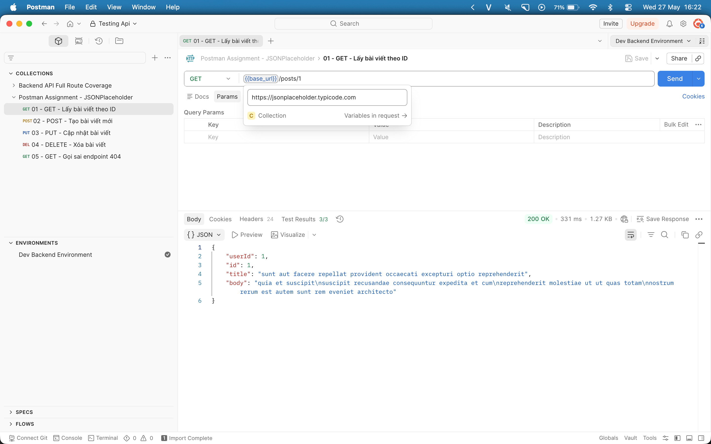
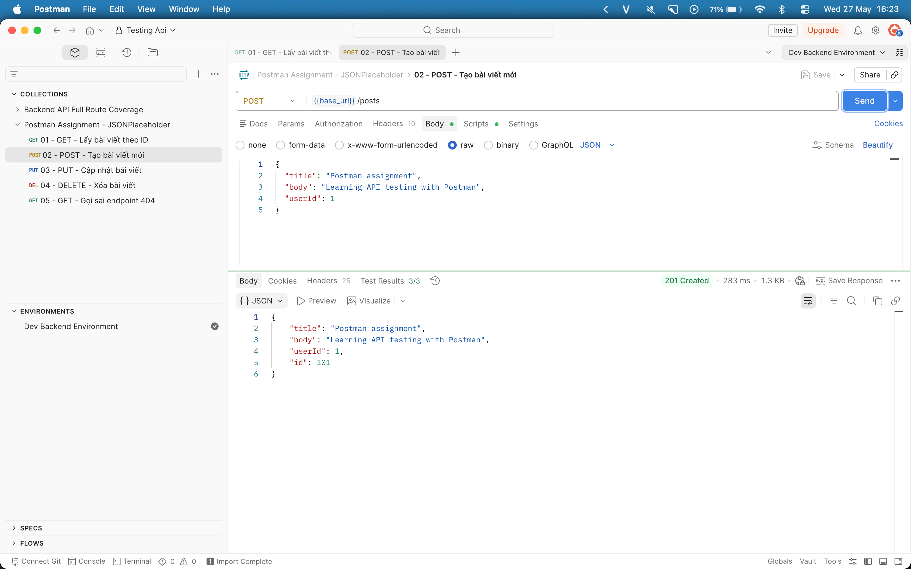
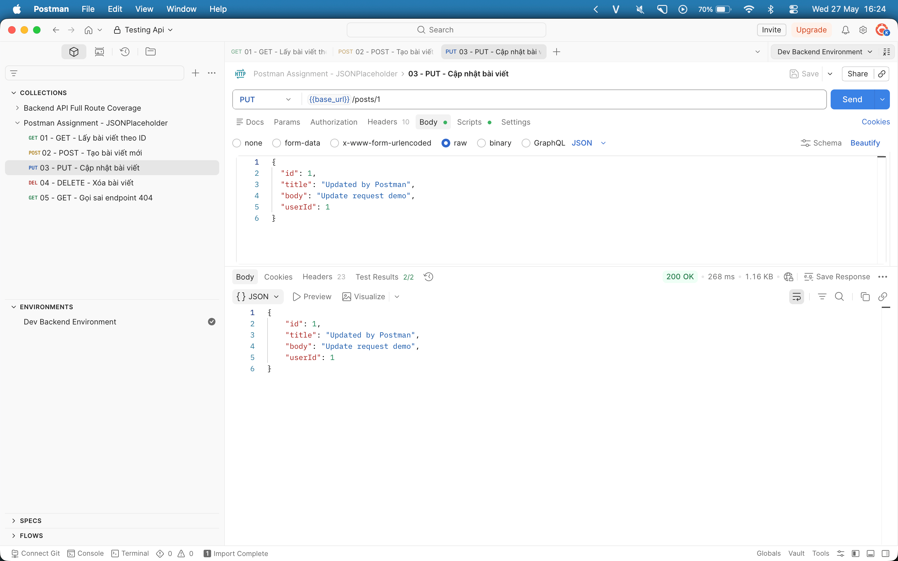
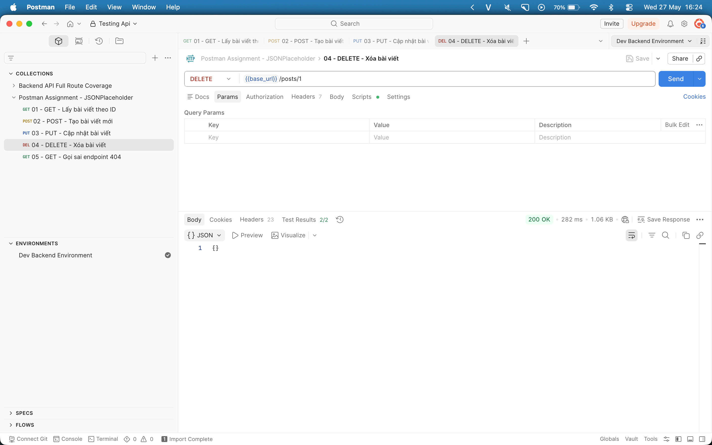
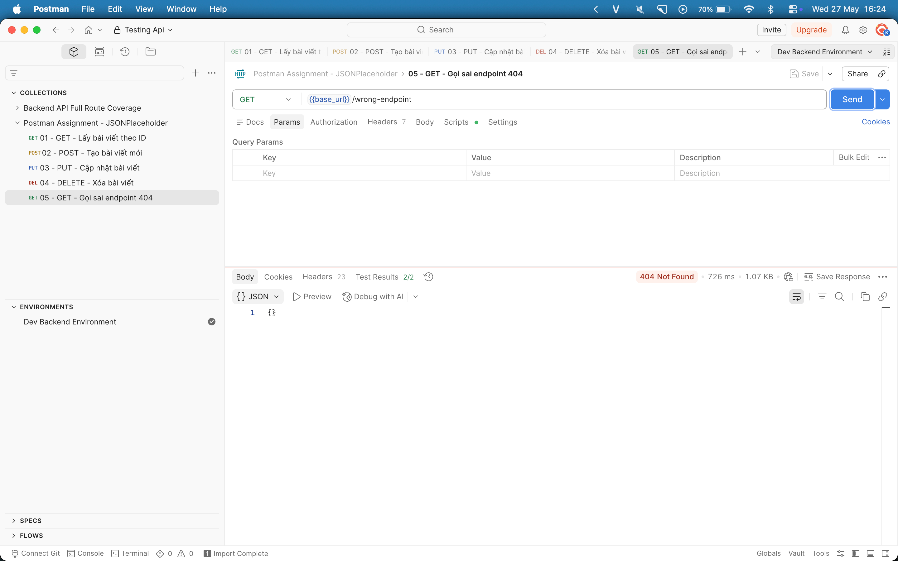

# BÁO CÁO KIỂM THỬ API BẰNG POSTMAN

## Thông tin chung

- Tên dự án: Test Collection of APIs with Postman
- Chủ đề: Học công cụ kiểm thử Postman và thực hành kiểm thử API
- Ngày kiểm thử: 27/05/2026
- Người thực hiện: `Nghiêm Đức Việt - 23010636`

## Tài liệu tham khảo

- Video yêu cầu của đề bài: https://www.youtube.com/watch?v=MFxk5BZulVU
- Repo mẫu tham khảo cách viết báo cáo: https://github.com/gtaAsian/New-Collection-of-APIs/tree/main
- Postman Docs - Collections: https://learning.postman.com/docs/collections/collections-overview
- Postman Docs - Variables: https://learning.postman.com/docs/postman/variables-and-environments/variables/
- Postman Docs - Test scripts: https://learning.postman.com/docs/writing-scripts/test-scripts/

## 1. Mục tiêu kiểm thử

Sử dụng Postman để kiểm thử một API thực tế, bao gồm:

- Tạo collection để quản lý request.
- Tạo biến `base_url` để tái sử dụng URL.
- Gửi request API với các method `GET`, `POST`, `PUT`, `DELETE`.
- Viết test script để kiểm tra status code, response body và response time.
- Ghi nhận kết quả kiểm thử bằng hình ảnh minh họa trong README.

## 2. Môi trường kiểm thử

- Công cụ: Postman Desktop App.
- API demo: https://jsonplaceholder.typicode.com
- Collection: [`postman_assignment_collection.json`](postman_assignment_collection.json)
- Biến collection:

| Tên biến | Giá trị |
| --- | --- |
| `base_url` | `https://jsonplaceholder.typicode.com` |

## 3. Phương pháp kiểm thử

- Kiểm thử thủ công: Gửi request trực tiếp trên Postman và quan sát response.
- Kiểm thử tự động: Sử dụng tab `Tests` trong Postman để viết script bằng JavaScript.
- Đối chiếu kết quả thực tế với kết quả mong đợi của từng kịch bản.

## 4. Kịch bản kiểm thử

### Kịch bản kiểm thử lần 1: Lấy thông tin bài viết

- Tên kịch bản: Kiểm thử API lấy bài viết theo ID.
- Mục đích: Kiểm tra API có trả về đúng thông tin bài viết hay không.
- Phương thức HTTP: `GET`
- URL: `{{base_url}}/posts/1`
- Tham số: `id = 1`
- Kết quả mong đợi:
  - Gửi request thành công.
  - Status code là `200`.
  - Response có trường `id = 1`.
  - Response có các trường `userId`, `id`, `title`, `body`.
- Kết quả thực tế: Request thành công, response trả về đúng cấu trúc dữ liệu.
- Trạng thái: Thành công.

Hình kết quả sau khi kiểm thử:



Test script:

```javascript
pm.test("Status code is 200", function () {
    pm.response.to.have.status(200);
});

pm.test("Response has post id 1", function () {
    const jsonData = pm.response.json();
    pm.expect(jsonData.id).to.eql(1);
});

pm.test("Response has required fields", function () {
    const jsonData = pm.response.json();
    pm.expect(jsonData).to.have.property("userId");
    pm.expect(jsonData).to.have.property("id");
    pm.expect(jsonData).to.have.property("title");
    pm.expect(jsonData).to.have.property("body");
});
```

### Kịch bản kiểm thử lần 2: Tạo bài viết mới

- Tên kịch bản: Kiểm thử API tạo bài viết mới.
- Mục đích: Kiểm tra API có nhận body JSON và trả về dữ liệu mới tạo hay không.
- Phương thức HTTP: `POST`
- URL: `{{base_url}}/posts`
- Header: `Content-Type: application/json`
- Body:

```json
{
  "title": "Postman assignment",
  "body": "Learning API testing with Postman",
  "userId": 1
}
```

- Kết quả mong đợi:
  - Gửi request thành công.
  - Status code là `201`.
  - Response có trường `id`.
  - Response trả về đúng `title` đã gửi.
- Kết quả thực tế: Request thành công, API trả về dữ liệu bài viết mới.
- Trạng thái: Thành công.

Hình kết quả sau khi kiểm thử:



Test script:

```javascript
pm.test("Status code is 201", function () {
    pm.response.to.have.status(201);
});

pm.test("Response contains created id", function () {
    const jsonData = pm.response.json();
    pm.expect(jsonData).to.have.property("id");
});

pm.test("Response returns correct title", function () {
    const jsonData = pm.response.json();
    pm.expect(jsonData.title).to.eql("Postman assignment");
});
```

### Kịch bản kiểm thử lần 3: Cập nhật bài viết

- Tên kịch bản: Kiểm thử API cập nhật bài viết.
- Mục đích: Kiểm tra API có cập nhật dữ liệu theo body mới hay không.
- Phương thức HTTP: `PUT`
- URL: `{{base_url}}/posts/1`
- Header: `Content-Type: application/json`
- Body:

```json
{
  "id": 1,
  "title": "Updated by Postman",
  "body": "Update request demo",
  "userId": 1
}
```

- Kết quả mong đợi:
  - Gửi request thành công.
  - Status code là `200`.
  - Response có `title = "Updated by Postman"`.
- Kết quả thực tế: Request thành công, response trả về title đã cập nhật.
- Trạng thái: Thành công.

Hình kết quả sau khi kiểm thử:



Test script:

```javascript
pm.test("Status code is 200", function () {
    pm.response.to.have.status(200);
});

pm.test("Response returns updated title", function () {
    const jsonData = pm.response.json();
    pm.expect(jsonData.title).to.eql("Updated by Postman");
});
```

### Kịch bản kiểm thử lần 4: Xóa bài viết

- Tên kịch bản: Kiểm thử API xóa bài viết.
- Mục đích: Kiểm tra API có xử lý request xóa dữ liệu hay không.
- Phương thức HTTP: `DELETE`
- URL: `{{base_url}}/posts/1`
- Tham số: `id = 1`
- Kết quả mong đợi:
  - Gửi request thành công.
  - Status code là `200`.
  - Response body rỗng hoặc là object rỗng.
- Kết quả thực tế: Request thành công, response trả về object rỗng.
- Trạng thái: Thành công.

Hình kết quả sau khi kiểm thử:



Test script:

```javascript
pm.test("Status code is 200", function () {
    pm.response.to.have.status(200);
});

pm.test("Response time is acceptable", function () {
    pm.expect(pm.response.responseTime).to.be.below(2000);
});
```

### Kịch bản kiểm thử lần 5: Gọi sai endpoint

- Tên kịch bản: Kiểm thử lỗi khi URL không tồn tại.
- Mục đích: Kiểm tra cách API phản hồi khi người dùng gọi sai endpoint.
- Phương thức HTTP: `GET`
- URL: `{{base_url}}/wrong-endpoint`
- Tham số: Không có.
- Kết quả mong đợi: API báo lỗi do endpoint không tồn tại.
- Kết quả thực tế: API trả về status code `404`.
- Trạng thái: Thành công về mặt xử lý lỗi.

Hình kết quả sau khi kiểm thử:



Test script:

```javascript
pm.test("Status code is 404", function () {
    pm.response.to.have.status(404);
});

pm.test("Response time is acceptable", function () {
    pm.expect(pm.response.responseTime).to.be.below(2000);
});
```

## 5. Bảng tổng hợp kết quả kiểm thử

| STT | Tên kịch bản | Method | Endpoint | Kết quả mong đợi | Kết quả thực tế | Trạng thái |
| --- | --- | --- | --- | --- | --- | --- |
| 1 | Lấy thông tin bài viết | GET | `/posts/1` | Status `200`, có `id = 1` | Đúng mong đợi | Thành công |
| 2 | Tạo bài viết mới | POST | `/posts` | Status `201`, có `id` | Đúng mong đợi | Thành công |
| 3 | Cập nhật bài viết | PUT | `/posts/1` | Status `200`, title mới | Đúng mong đợi | Thành công |
| 4 | Xóa bài viết | DELETE | `/posts/1` | Status `200` | Đúng mong đợi | Thành công |
| 5 | Gọi sai endpoint | GET | `/wrong-endpoint` | Status `404` | Đúng mong đợi | Thành công về mặt xử lý lỗi |

## 6. Kết quả kiểm thử

- Số lượng kịch bản đã kiểm thử: 5
- Số kịch bản thành công: 5
- Số kịch bản thất bại: 0
- Tỉ lệ thành công: 100%

## 7. Phát hiện lỗi và nhận xét

- ID lỗi: `404 Not Found`
- Mô tả: Khi gọi sai endpoint `/wrong-endpoint`, API trả về status code `404`.
- Mức độ ảnh hưởng: Thấp, vì đây là lỗi do người dùng gọi sai URL.
- Ghi chú/đề xuất:
  - Cần kiểm tra đúng endpoint trước khi gửi request.
  - Nên viết test case cho các trường hợp lỗi để đảm bảo API phản hồi rõ ràng.

## 8. Kết luận

Qua bài thực hành, em đã biết cách sử dụng Postman để tạo collection, gửi request API, cấu hình biến `base_url` và viết test script cơ bản. Postman hỗ trợ tốt cho kiểm thử API vì có giao diện trực quan, dễ lưu request và có thể tự động hóa việc kiểm tra kết quả trả về.
