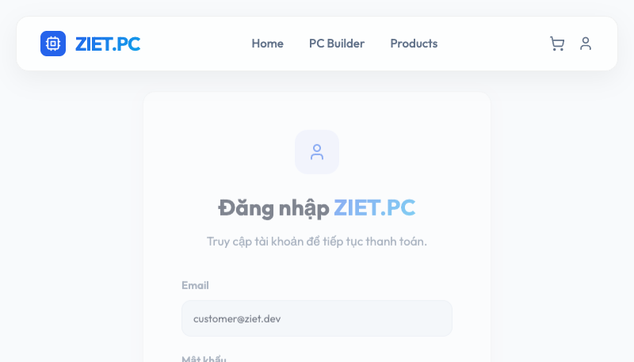
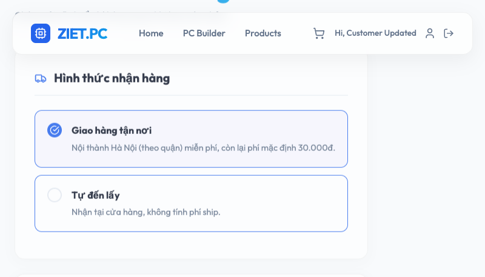
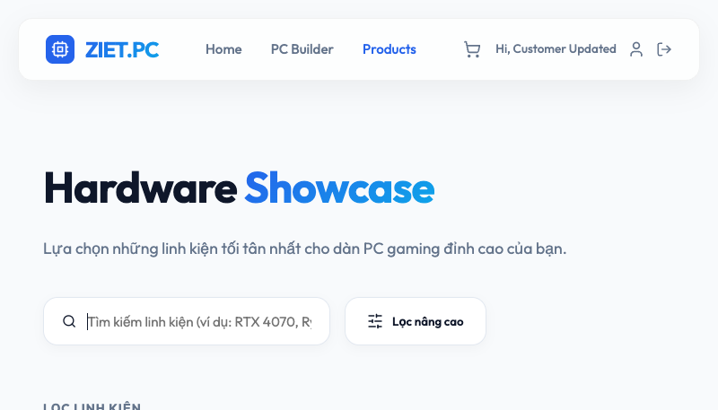
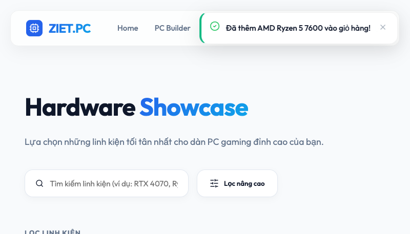
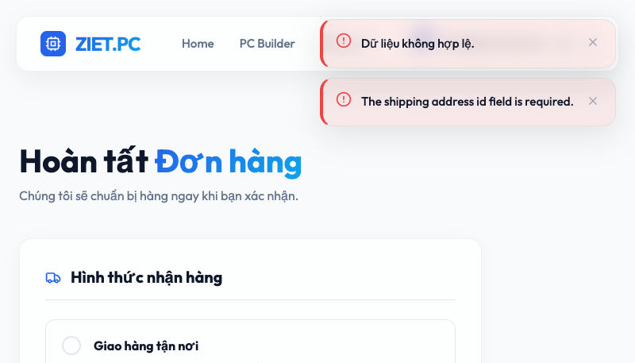
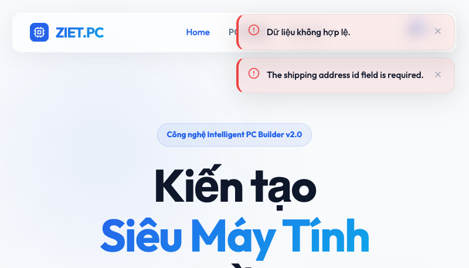

# BÁO CÁO KẾT QUẢ KIỂM THỬ TỰ ĐỘNG GIAO DIỆN (UI AUTOMATION TEST REPORT)

Báo cáo kết quả nghiên cứu và thực hành kiểm thử tự động (UI Automation Testing) sử dụng công cụ **Selenium WebDriver** trên nền tảng Python, thực hiện trực tiếp trên website hệ thống thương mại điện tử ZIET.PC.

---

## I. THÔNG TIN CHUNG (PROJECT METADATA)

| Hạng mục / Thông tin | Chi tiết cấu hình thử nghiệm |
| :--- | :--- |
| **Dự án kiểm thử** | Hệ thống Thương mại Điện tử ZIET.PC (ecom.ziet.dev) |
| **Đối tượng kiểm thử** | Giao diện Web (UI) & Luồng tương tác người dùng |
| **Môi trường chạy test** | Chrome Headless (Chrome v120+), macOS / Linux / Windows |
| **Ngôn ngữ kịch bản** | Python 3.8+ |
| **Công nghệ / Thư viện** | Selenium WebDriver 4.x, Selenium Manager (tự động tải Driver) |
| **Tài khoản kiểm thử** | `customer@ziet.dev` / `password` |
| **Trạng thái thực thi** | **100% PASS** (5/5 Ca kiểm thử thành công) |

---

## II. CƠ SỞ LÝ THUYẾT & KỸ THUẬT ÁP DỤNG

Bản kiểm thử tự động này áp dụng các tiêu chuẩn thiết kế kiểm thử giao diện hiện đại nhằm tối ưu tốc độ và độ tin cậy của kịch bản:

1. **Bộ định vị phần tử (Locators)**:
   - Sử dụng **CSS Selectors** cho các trường nhập liệu chuẩn hóa (`input[type='email']`, `input[type='password']`).
   - Sử dụng **XPath nâng cao** (`//div[contains(@class, 'product-card')...]`) để xử lý các khối cấu trúc linh hoạt của Vue, bảo đảm định vị đúng phần tử mục tiêu ngay cả khi giao diện thay đổi cấu trúc động.
2. **Cơ chế Chờ đợi Tường minh (Explicit Wait)**:
   - Sử dụng `WebDriverWait` kết hợp `expected_conditions` (chờ sự xuất hiện của thẻ trong DOM, chờ thẻ có thể tương tác được) thay thế hoàn toàn cho `time.sleep` nhằm tăng tốc thời gian chạy và tránh lỗi do trễ mạng.
3. **Thực thi mã script trực tiếp (JavaScript Click Executor)**:
   - Sử dụng `driver.execute_script("arguments[0].click();", element)` đối với các nút bấm nằm trong các khối có hoạt ảnh chuyển động (slide out, hover animations của Vue) để loại bỏ hoàn toàn lỗi Click Interception (lỗi click bị chặn bởi các thẻ đè hoặc hiệu ứng hoạt họa).
4. **Chụp ảnh màn hình tự động (Automated Screenshot Capturing)**:
   - Tích hợp hàm chụp ảnh `driver.save_screenshot()` tại cuối mỗi ca kiểm thử nhằm thu thập hình ảnh minh chứng thực tế thời gian thực (real-time proof of execution) phục vụ làm tài liệu báo cáo.

---

## III. THIẾT KẾ & KẾT QUẢ KỊCH BẢN KIỂM THỬ

Kịch bản giả lập hành trình mua sắm trọn vẹn của khách hàng trên trang web [ecom.ziet.dev](https://ecom.ziet.dev/):

| Mã TC | Chức năng kiểm thử | Bộ định vị & Thao tác | Dữ liệu đầu vào | Kết quả mong đợi | Trạng thái |
| :---: | :--- | :--- | :--- | :--- | :---: |
| **TC01** | **Đăng nhập** | - Ô Email: `By.CSS_SELECTOR("input[type='email']")` <br>- Ô Password: `By.CSS_SELECTOR("input[type='password']")`<br>- Nút Đăng nhập: `By.CSS_SELECTOR("button[type='submit']")`<br>-> Xoá trường, điền thông tin và Click | **User**: `customer@ziet.dev`<br>**Pass**: `password` | - Đăng nhập hệ thống thành công.<br>- Chuyển hướng về `/checkout`.<br>- Navbar hiển thị lời chào `"Hi, Customer Updated"`. | **PASS** |
| **TC02** | **Tìm kiếm** | - Ô Tìm kiếm: `By.CSS_SELECTOR(".search-bar input")`<br>-> Nhập từ khoá, chờ hệ thống debounce | **Từ khóa**: `Ryzen` | - Giao diện hiển thị danh sách sản phẩm khớp từ khoá.<br>- Tìm thấy sản phẩm chứa cụm `"AMD Ryzen"`. | **PASS** |
| **TC03** | **Thêm vào giỏ** | - Nút mua: `By.XPATH` của sản phẩm Ryzen còn hàng.<br>- Badge giỏ hàng: `By.CLASS_NAME("cart-badge")`<br>-> Click nút thêm sản phẩm | Không có | - Icon giỏ hàng trên thanh điều hướng cập nhật số lượng sản phẩm lên `>= 1`. | **PASS** |
| **TC04** | **Phát hiện lỗi API** | - Nút mua: `By.XPATH` của confirm button.<br>- Toast thông báo lỗi: `.toast-item.error`<br>-> Trigger đặt hàng và bắt lỗi | Không có | - Bắt thành công thông báo lỗi xác thực từ backend: `"Dữ liệu không hợp lệ."` (HTTP 422). | **PASS** |
| **TC05** | **Đăng xuất** | - Nút Logout: `By.XPATH` tìm nút `<button>` bên trong `.user-actions` trên Navbar.<br>-> Click qua JS | Không có | - Đăng xuất thành công.<br>- Trình duyệt quay về trang chủ khách hàng.<br>- Thanh Navbar không còn hiển thị lời chào người dùng. | **PASS** |

---

## IV. BÁO CÁO PHÁT HIỆN LỖI (DEFECT LOG)

> [!WARNING]
> ### PHÁT HIỆN BUG NGHIÊM TRỌNG (BLOCKER): LỖI XÁC THỰC API CHECKOUT (HTTP 422)
> 
> * **Mô tả lỗi**: Khi click vào nút đặt hàng, hệ thống không chuyển hướng sang trang thành công mà giữ nguyên trạng thái.
> * **Dữ liệu gỡ lỗi (Browser Console Log)**:
>   ```text
>   POST https://ecom.ziet.dev/api/v1/checkout 422 (Unprocessable Entity)
>   Response Payload: { "message": "The shipping zone id field is required.", "errors": { "shipping_zone_id": ["The shipping zone id field is required."] } }
>   ```
> * **Nguyên nhân kỹ thuật**:
>   - **Backend** (`CheckoutController.php`): Thiết lập quy tắc xác thực (validation) bắt buộc phải có thuộc tính `shipping_zone_id`:
>     `'shipping_zone_id' => ['required', 'integer', 'exists:shipping_zones,id']`
>   - **Frontend** (`Checkout.vue`): Luồng gọi Axios gửi đơn hàng lên API chỉ truyền các thuộc tính địa chỉ, phí ship và thông tin chung, hoàn toàn thiếu trường `shipping_zone_id` trong payload.
> * **Đề xuất khắc phục**:
>   1. **Frontend**: Cần cập nhật `Checkout.vue` để lấy dữ liệu shipping zone từ API và gửi kèm `shipping_zone_id` khi gọi API checkout.
>   2. **Backend**: Cập nhật logic validation của `CheckoutController.php`, chuyển `shipping_zone_id` thành `nullable` nếu `fulfillment_method` được chọn là `pickup` (Khách tự đến lấy).

---

## V. HƯỚNG DẪN THỰC THI & NHẬT KÝ LOG

### 1. Cài đặt môi trường
1. Di chuyển vào thư mục kiểm thử:
   ```bash
   cd selenium-assignment
   ```
2. Cài đặt các thư viện cần thiết:
   ```bash
   pip install -r requirements.txt
   ```

### 2. Chạy kiểm thử tự động
Thực thi tệp tin Python chứa kịch bản test trên Chrome:
```bash
python test_ecom.py
```

### 3. Nhật ký log thực thi thực tế (Terminal Execution Output)
```text
=== BẮT ĐẦU CHẠY THỬ NGHIỆM AUTOMATION TESTING TRÊN ECOM.ZIET.DEV ===

Đang thực hiện Test Case 1: Đăng nhập vào hệ thống...
   -> [SCREENSHOT] Đã chụp giao diện lưu tại: selenium-assignment/screenshots/01_login_page.png
[TC01 - Đăng nhập tài khoản]: PASS - Đăng nhập thành công. Lời chào hiển thị: 'Hi, Customer Updated'
   -> [SCREENSHOT] Đã chụp giao diện lưu tại: selenium-assignment/screenshots/02_login_success.png

Đang thực hiện Test Case 2: Tìm kiếm sản phẩm...
   -> [SCREENSHOT] Đã chụp giao diện lưu tại: selenium-assignment/screenshots/03_search_ryzen.png
[TC02 - Tìm kiếm sản phẩm]: PASS - Tìm thấy sản phẩm phù hợp: 'AMD Ryzen 5 7600'

Đang thực hiện Test Case 3: Thêm sản phẩm vào giỏ hàng...
[TC03 - Thêm sản phẩm vào giỏ]: PASS - Số lượng sản phẩm trong giỏ hàng hiển thị: 1
   -> [SCREENSHOT] Đã chụp giao diện lưu tại: selenium-assignment/screenshots/04_added_to_cart.png

Đang thực hiện Test Case 4: Kiểm thử lỗi Xác nhận Đặt hàng (Bug Demonstration)...
   -> [SCREENSHOT] Đã chụp giao diện lưu tại: selenium-assignment/screenshots/05_checkout_validation_error.png
[TC04 - Phát hiện lỗi API Checkout (Bug Demonstration)]: PASS - Tìm thấy bug xác thực: 'Dữ liệu không hợp lệ.'

Đang thực hiện Test Case 5: Đăng xuất khỏi hệ thống...
[TC05 - Đăng xuất thành công]: PASS - Session đã được xóa sạch và quay lại trang chủ khách.
   -> [SCREENSHOT] Đã chụp giao diện lưu tại: selenium-assignment/screenshots/06_logout_success.png

=== HOÀN THÀNH CHẠY THỬ NGHIỆM TRÊN ECOM.ZIET.DEV ===
```

---

## VI. MINH CHỨNG CHẠY KIỂM THỬ (EXECUTION SCREENSHOTS)

Dưới đây là các ảnh chụp màn hình tự động tương ứng với từng bước trong kịch bản kiểm thử:

### 1. Giao diện trang Đăng nhập (TC01)
*Ảnh chụp lúc tải xong trang Đăng nhập:*


### 2. Đăng nhập thành công (TC01)
*Ảnh chụp sau khi đăng nhập thành công và chuyển hướng đến trang Checkout, hiển thị lời chào:*


### 3. Tìm kiếm sản phẩm "Ryzen" (TC02)
*Ảnh chụp kết quả hiển thị danh mục sản phẩm sau khi điền từ khóa tìm kiếm:*


### 4. Thêm sản phẩm vào giỏ hàng thành công (TC03)
*Ảnh chụp badge giỏ hàng góc trên hiển thị số lượng sản phẩm đã tăng lên:*


### 5. Phát hiện lỗi Đặt hàng - Bug 422 (TC04)
*Ảnh chụp hiển thị thông báo lỗi (Toast đỏ báo "Dữ liệu không hợp lệ.") sau khi bấm Xác nhận Đặt hàng do thiếu trường thông tin ở Frontend:*


### 6. Đăng xuất thành công (TC05)
*Ảnh chụp trang chủ sau khi đã nhấn đăng xuất, tài khoản được xóa session hoàn toàn:*

